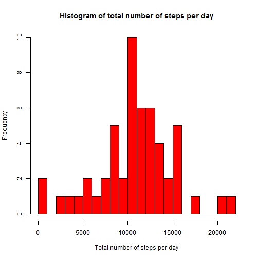
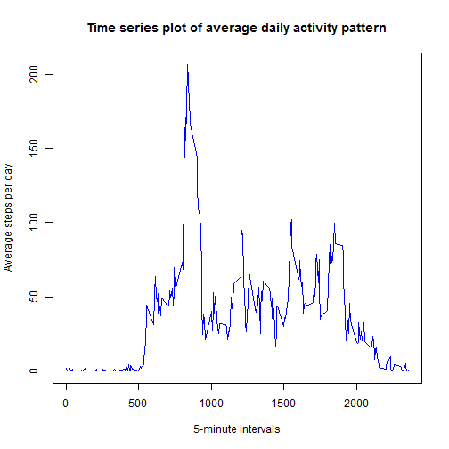
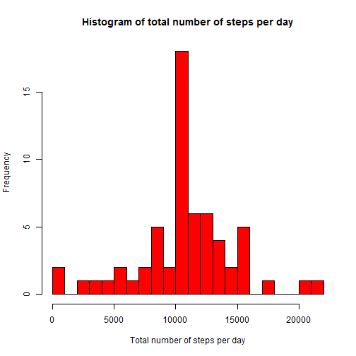
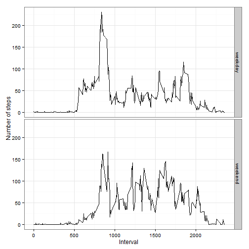

## 1 Loading and preprocessing the data

### 1.a Load the data
### 2.b Process/transform the data (if necessary) into a format suitable for analysis


```r
## Unzip data file
## unzip("activity.zip")
## Load data into a data frame 
pa_data <- read.csv("activity.csv")
## Convert date format
pa_data$date <- as.Date(pa_data$date)
```


## 2 What is mean total number of steps taken per day?

### 2.a Calculate the total number of steps taken per day


```r
## Remove NA from data
pa_data_clean <- pa_data[complete.cases(pa_data),]
## Load dplyr package
library(dplyr)
## Group data by date and calculate total step per day
total_steps_by_date <- pa_data_clean %>% group_by(date) %>% summarise(total_steps =sum(steps))
```

### 2.b Histogram of total number of steps per day


```r
hist(total_steps_by_date$total_steps, 
     col="red", breaks=25, 
     main="Histogram of total number of steps per day",
     xlab="Total number of steps per day")
```

 

###  2.c Calculate and report the mean and median of the total number of steps taken per day

```r
## Mean of the total number of steps taken per day
mean(total_steps_by_date$total_steps)
```

```
## [1] 10766.19
```

```r
## Median of the total number of steps taken per day
median(total_steps_by_date$total_steps)
```

```
## [1] 10765
```

## 3 What is the average daily activity pattern?

### 3.a Time series plot of average daily activity pattern


```r
## Group data by interval and calculate mean of the total number of steps taken per day

avg_daily_activity_by_interval <- pa_data_clean %>% 
  group_by(interval) %>% 
  summarize(avg_steps = mean(steps, na.rm = TRUE))
## Time series plot of average daily activity pattern
plot(avg_daily_activity_by_interval$interval, 
     avg_daily_activity_by_interval$avg_steps, 
     type="l", col="blue",
     main="Time series plot of average daily activity pattern",
     xlab="5-minute intervals", ylab="Average steps per day"
     )
```

 

### 3.b Which 5-minute interval, on average across all the days in the dataset, contains the maximum number of steps?


```r
## 5-minute interval, with maximum number of average steps across all dates
filter(avg_daily_activity_by_interval, avg_steps == max(avg_steps)) %>%
  arrange(interval,avg_steps)
```

```
## Source: local data frame [1 x 2]
## 
##   interval avg_steps
## 1      835  206.1698
```


## 4 Imputing missing values

### 4.a Calculate and report the total number of missing values in the dataset


```r
## Number of total missing values in rows/cols
colSums(is.na(pa_data))
```

```
##    steps     date interval 
##     2304        0        0
```

### 4.b Devise a strategy for filling in all of the missing values in the dataset
For some dates, all values in steps are NA's, which does not make possible to calculate
mean or median for those specific dates.
The strategy for filling NA's is replace them with the mean value of steps in the interval

### 4.c Create a new dataset that is equal to the original dataset but with the missing data filled in 


```r
## New data set 
pa_data_NAs_replaced <- pa_data %>%
  group_by(interval) %>% 
  mutate(steps= ifelse(is.na(steps), mean(steps, na.rm=TRUE), steps)) %>%
  ungroup()
```

### 4.d Make a histogram of the total number of steps taken each day and Calculate and report the mean and median total number of steps taken per day. Do these values differ from the estimates from the first part of the assignment? What is the impact of imputing missing data on the estimates of the total daily number of steps?
As can be seen, histogram, mean and median values are exactly the same before and after replacing NA values, on the basis of select filling strategy. **There's no impact**


```r
## Group data by date and calculate total steps per day
total_steps_by_date_NAs_replaced <- pa_data_NAs_replaced %>% 
  group_by(date) %>%
  summarise(total_steps =sum(steps)) %>%
  ungroup()
## Histogram
hist(total_steps_by_date_NAs_replaced$total_steps, 
     col="red", breaks=25, 
     main="Histogram of total number of steps per day",
     xlab="Total number of steps per day")
```

 

```r
## Mean of the total number of steps taken per day
mean(total_steps_by_date_NAs_replaced$total_steps)
```

```
## [1] 10766.19
```

```r
## Median of the total number of steps taken per day
median(total_steps_by_date_NAs_replaced$total_steps)
```

```
## [1] 10766.19
```

## 5 Are there differences in activity patterns between weekdays and weekends?
As can be seen in the panel plot histogram, there are significant differences in activity patterns between weekdays and weekends:

- More steps in all intervals on weekends except in early morning time
- Compared to weekends, more steps on weekdays at early morning and late afternoon, and less steps the rest of intervals

### 5.1 Create a new factor variable in the dataset with two levels - "weekday" and "weekend" indicating whether a given date is a weekday or weekend day


```r
## Create a new factor variable in the dataset with 
## two levels - "weekday" and "weekend" indicating whether a given date 
## is a weekday or weekend day.
## Set locale to use english weekdays names
curr_locale <- Sys.getlocale("LC_TIME")
Sys.setlocale("LC_TIME","English")
```

```
## [1] "English_United States.1252"
```

```r
## Create new column with text values "weekend" or "weekday" based on weekday of date
pa_data_NAs_replaced <- pa_data_NAs_replaced %>% 
  mutate( weekday = 
            ifelse( (weekdays(date) == "Saturday" | weekdays(date) == "Sunday"), 
                    "weekend", 
                    "weekday"))
## Convert new column to factor
pa_data_NAs_replaced$weekday <- as.factor(pa_data_NAs_replaced$weekday)
## Restore locale
Sys.setlocale("LC_TIME",curr_locale)
```

```
## [1] "Spanish_Spain.1252"
```

### 5.2 Make a panel plot containing a time series plot of the 5-minute interval (x-axis) and the average number of steps taken, averaged across all weekday days or weekend days (y-axis)


```r
## Group data by weekday and calculate mean of the total number of steps taken per day
avg_daily_activity_by_interval_and_weekday <- pa_data_NAs_replaced %>% 
  group_by(interval, weekday) %>% 
  summarize(avg_steps = mean(steps, na.rm = TRUE))
## Time series panel plot of average daily activity pattern (ggplot2 package)
library(ggplot2)
g <- ggplot(avg_daily_activity_by_interval_and_weekday, aes(x = interval, y = avg_steps))
g + geom_line() + facet_grid(weekday ~ .) + labs(x = "Interval") + labs(y = "Number of steps") + theme_bw()
```

 
